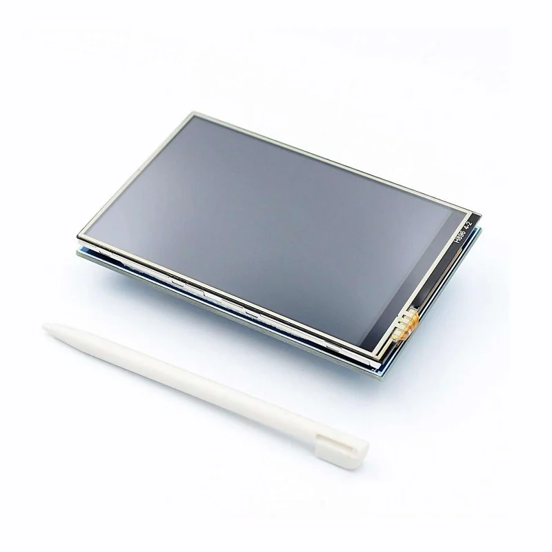
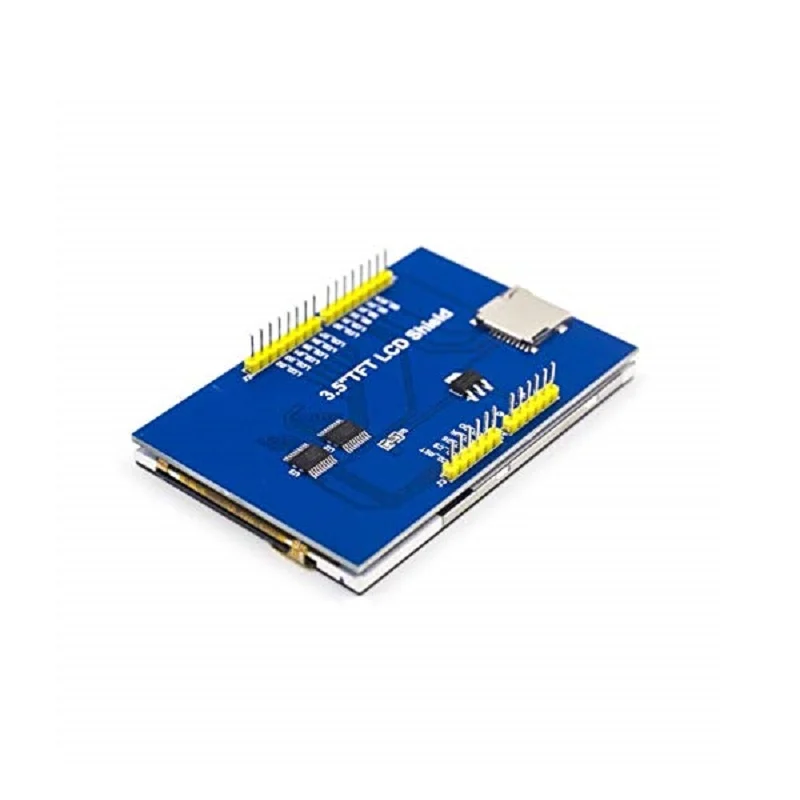
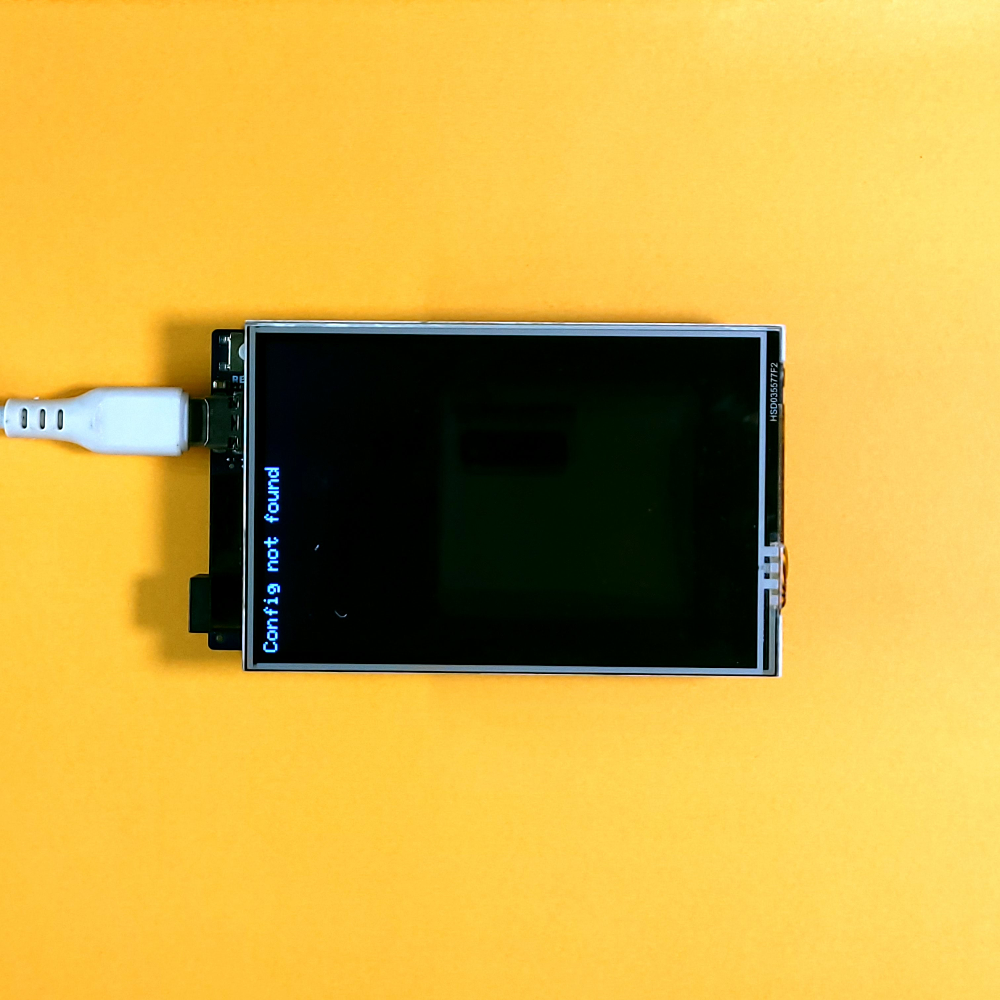
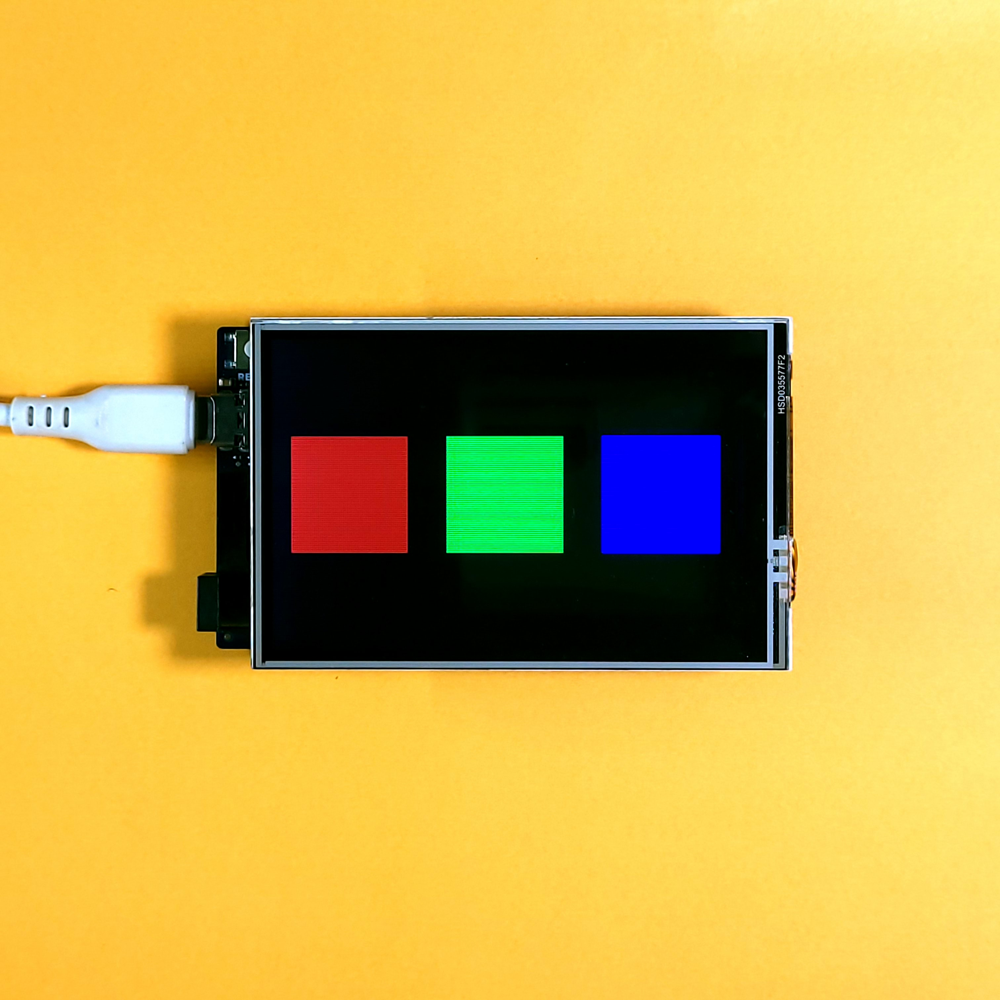
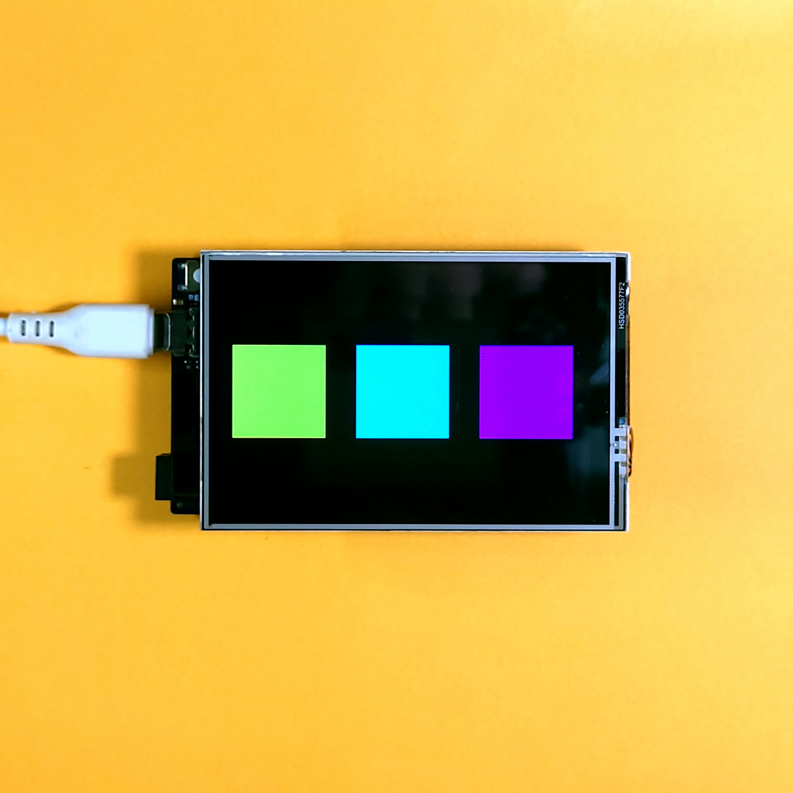

# Load Config File from SD Card And Use It with a 3.5" TFT LCD Touchscreen With Arduino UNO R3/R4


## Overview

This repository contains a program to read a config file from an SD Card and use the data to change the program execution on an Arduino UNO R3/R4/Mega nad a 3.5" TFT LCD Shield, as shown below -

|||
|-|-|

Most 3.5" TFT LCD Touch displays use the ILI9486 Display Driver and include a resistive touchscreen. **The PCB Layout & silkscreen text may vary slightly between displays. This does not change their behaviour and functionality.** This repository depends on the following libraries -

- [Adafruit Touch Screen Library](https://github.com/adafruit/Adafruit_TouchScreen) to manage touch input
- [Adafruit GFX Library](https://github.com/adafruit/Adafruit-GFX-Library/tree/master) for graphics primitives
- [This fork of the MCUFriend KBV library](https://github.com/slviajero/MCUFRIEND_kbv) to drive the display (this makes it compatible with the UNO R4)

The program has been written using PlatformIO, and has been tested on the [Arduino UNO R3](https://docs.arduino.cc/hardware/uno-rev3/), [Arduino UNO R4 Minima](https://docs.arduino.cc/hardware/uno-r4-minima/) & [Arduino UNO R4 WiFi](https://docs.arduino.cc/hardware/uno-r4-wifi/).

> [!TIP]
> A detailed tutorial on how to use this repository is available at https://dumblebots.com/2024/07/02/using-3-5-tft-lcd-display-with-ili9486-arduino-part-3-text-files-sd-card/. The tutorial includes a comprehensive explanation of the code and how to use it.

## Building/Uploading With PlatformIO

Since this project has been written using PlatformIO by default, simply run the following commands to fetch the libraries, build the project and upload the program -

```shell
pio pkg install
pio run
pio run --target upload
```

## Building/Uploading With Arduino IDE

Create a new sketch and copy the contents of [```src/main.cpp```](/src/main.cpp) from this repository into the default ```.ino``` file. Create a new tab/file in the IDE named ```constants.h``` and copy the contents of [```src/constants.h```](/src/constants.h) from this repository into this file.

Install the Adafruit Touch Screen Library and Adafruit GFX Library from the Library Manager (under *Sketch>Include Library>Manage Libraries...*)

Download [this](https://github.com/slviajero/MCUFRIEND_kbv) repository as a ZIP file and install it by navigating to *Sketch>Include Library>Add .ZIP Library*, and selecting the downloaded file from the file explorer.

After this, you can Build and Upload the program as usual.


## Using the Example

As soon as the program is uploaded, the display should turn black and the following message should be printed on the display -



Next, create a file called `CONFIG.TXT` on a *FAT formatted SD Card*, which will be inserted into the SD Card slot on the TFT LCD Shield. The file must contain three color codes, which will be used to draw three squares on the display. Two examples are shown below -


### Example 1

Config file -

```
square-1-color" = f800"
"square-2-color" = "07E0"
"square-3-color" = "001F"
```

Result -



### Example 2

Config file -

```
"square-1-color"  =   "fFe0" // Yellow

"square-2-color" = "7ff" // Cyan
"square-3-color"  = "F81F" // Magenta

```

Result -



> [!TIP]
> To create your own colors, see [this guide](https://dumblebots.com/2024/05/10/using-3-5-tft-lcd-display-ili9486-arduino-part-1-get-started/).


## Troubleshooting

Some common problems and their solutions -

|Problem|Solution|
|-|-|
|Display stays white after uploading program|Non-Standard Driver (not ILI9486)|
|Display not responding after touch|Try changing the order of the touch pins in [```src/constants.h```](/src/constants.h) file, i.e. swap the values of ```XP```, ```YP```, ```XM``` and ```YM```|
|Compilation issues related to SPI|Update the Arduino IDE version and/or install the SPI library|
|Display Flickering/Arduino is reset automatically|Faulty Power Supply/Cable|
